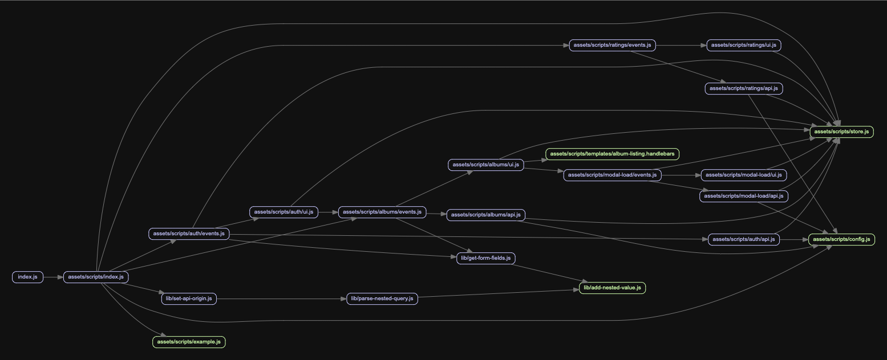
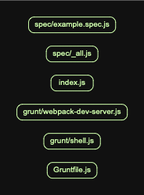
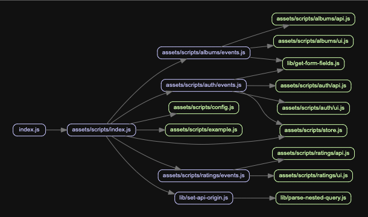
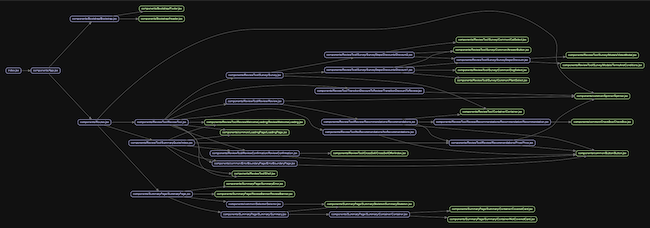

## EZ-MADGE

Madge helps us to easily map dependencies between files.

[Madge Documentation](https://github.com/pahen/index)

This is a package that provides a way to quickly and easily integrate madge into your Javascript project.

It comes with 4 out of the box charts.

**NOTE:** By default, only js and jsx files are mapped. Future releases will extend this functionality.

## Examples
**NOTE:** For proper mapping, please point to the entry point (top level) of your app.

#### Chart 1: Map all dependencies
This is the standard diagram that depicts all of your dependencies being mapped.



#### Chart 2: Map Orphan nodes

These diagrams tell you which files are not imported or referenced through your app. 
Great for identifying unused files for deletion.



#### Chart 3: Depth Level Mapping

This diagram let you map to only certain depth in the tree. 

Great for larger projects.



#### Chart 4: Filter dependency files by extension - WIP

This diagram filters the tree nodes dependencies based on the file extension.

Madge has file extension filter of its own. 
This is useful for designating the parent nodes you want to limit by file extension.

This does not allow you to filter the dependent nodes by file extension.
 
As a result, you could have files you do not want to see, polluting your map.

This implementation differs as it filters both the parent and children dependencies.

The use case it was developed for was to see the interaction of React components as designated by the .jsx extension

**NOTE:** By default, the '.jsx' used in React projects, is the dependency filter extension.



## Install

```bash
$ npm install ez-madge --save-dev
```

## Installing graphviz

Graphviz draws the diagrams.

Unfortunately, there is no out of the box way to integrate with the npm version of Graphviz.

As a result, you need to install Graphviz locally to run the tests. You can install it using brew.

`brew install graphviz`

You can run index from the cli or run it using node. 
Running it in node, gives you more opportunity to closely configure your visualization.

## Usage

There is 2 ways to use this file:

CLI or API

### CLI usage

You can install the package globally to use the cli
```bash
$ npm install ez-madge -G
```

```
  Usage
    $ ez-madge <target file>

  Options
    --depth, -d  Determine levels of depth
    --output, -o  Determine an output location
    --font, -f  Change fontSize
    --vertical, -v  Graph vertical tree

  Examples
  $ ez-madge myApp/src/index.js -d=4
```


### API usage

```javascript
import mapDependencies from 'ez-madge'

const options = {
    // levelDepth is used for the diagramming options
    levelDepth: 3,
    // This is used to limit the dependencies of the parent and dependent nodes
    filteredExtensions:  ['js', 'jsx', 'graphql'],
    //These are common madge options - Please see Madge documentation for more details
    madge: {
      // font size for the diagram
      fontSize: '10px',
      // flag to include npm packages
      includeNpm: false,
      // file extensions to include in the parent nodes
      fileExtensions: ['js', 'jsx'],
      // Files to exclude from mapping.
      // It is generally a good idea to exclude test files at the minimum
      excludeRegExp: ['.*.test.jsx?$', '.scss$'],
      graphVizOptions: {
        G: {
          // Direction to map
          // LR = Left to right; 
          // TB= Top to Bottom;
          rankdir: 'LR'
        }
      }
    }
  };
};


mapDependencies(targetFile, diagramSaveLocation, options)

```
